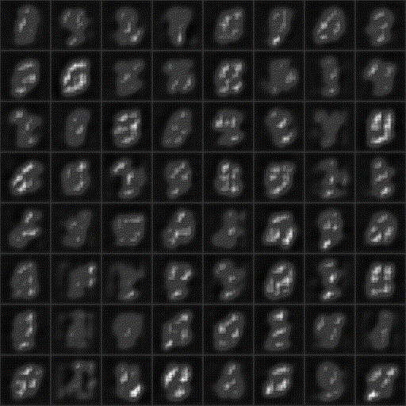
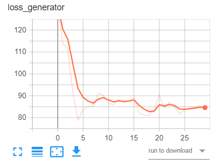

# MNIST-WGAN-GP
 Treinamento de GAN utilizando MNIST e wasserstein loss + Gradient Penalty

- Repositório muito bom (**excelente**) utilizado para aprendizado: [https://github.com/aladdinpersson/Machine-Learning-Collection.git](https://github.com/aladdinpersson/Machine-Learning-Collection.git)

- Este repositório mostra a implementação do treinamento de uma GAN, utilizando o dataset MNIST, utilizando Wasserstein Loss + Gradient Penalty.  

- Resultado ao longo de 30 épocas:  



- Análise dos valores discriminator-loss e generator-loss.  
   

Ambos os valores têm comportamentos de convergência, mostrando que a abordagem Wasserstein-loss com Gradienty-Penalty é muito eficaz na proposta de promover um treinamento estável e com convergência.  

- Variáveis utilizadas no treinamento:  

```
CHANNEL_NOISE = 1
NOISE_DIM = 100
IMG_CHANNEL = 1
FEATURES = 16
BATCH_SIZE = 128
IMG_SIZE = 64
LEARNING_RATE = 1e-4
TAXA_TREINAMENTO_DISCRIMINATOR = 5  # ou seja, o discriminator treina 5 vezes mais que o generator
LAMBDA_GP = 10 # TAXA DO GRADIENT PENALTY
```
